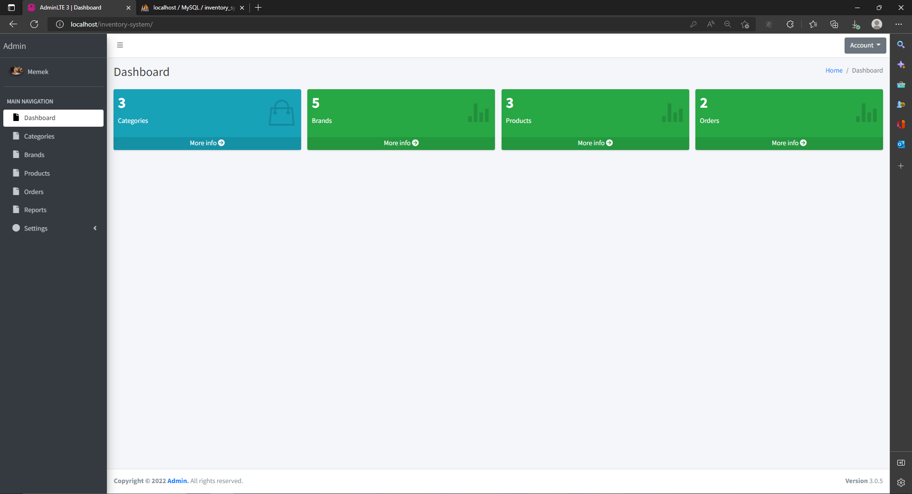
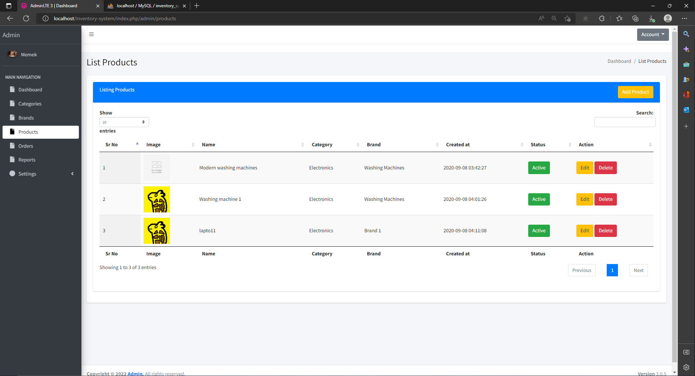
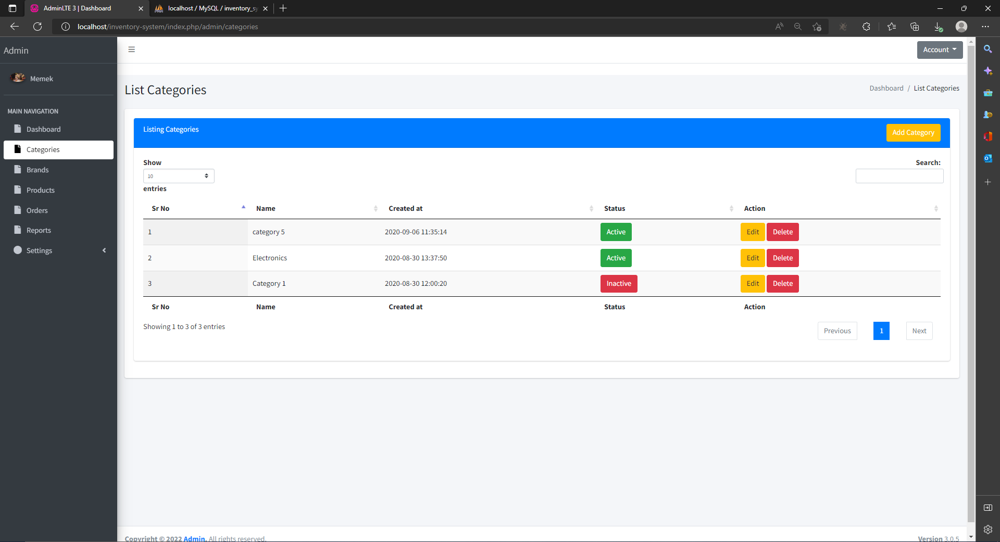
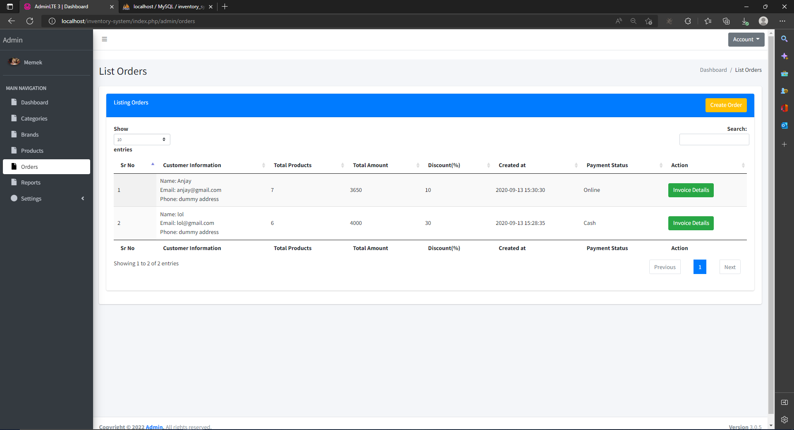
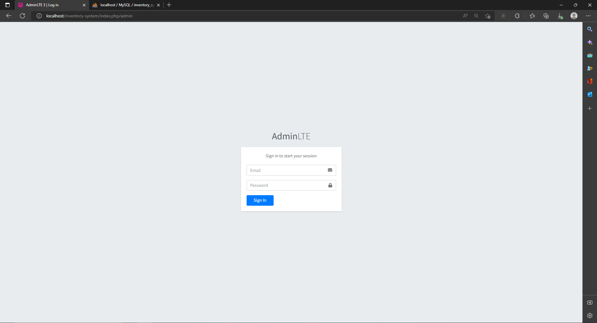

# Inventory-system using CodeIgniter3

## How to run
Run in WAMP or XAMP server, you need to download this server tool first.

## Technology, Tool and language
- PHP
= MySQL
- CodeIgniter3
- HTML and CSS
- Bootstrap
